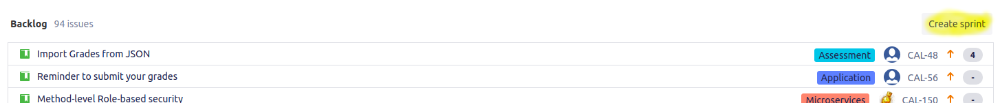

# Create Sprint

This will walk through the process needed to create a sprint in Jira

1. Navigate to the project URL and select `Backlog` from the left side pane

2. Select `Create Sprint` located above Backlog
    

3. A sprint will be created with a default name and number based off the last sprint. Click the three dots to the right side and `Edit Sprint`. Chnage the name of the sprint to be `<Trainer Name> - Batch <Salesforce batch id>` ex `John Smith - Batch 554`

4. From the backlog drag the user stories that the sprint will work on into the sprint section.:w
