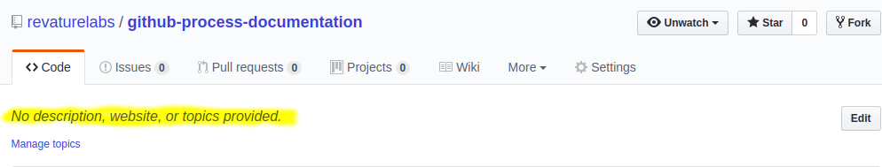

# Setting up a new Project

* Notify <> and have a Jira workspace created
* Create a Github repository for the project
  * For microservices or any project which will have many repositories use meta for the creation of the meta repo
  * Add a .gitignore to the repository (if using meta init, one will be created automatically)
  * Add a README.md file to the repository that has a tittle and breif description of the project
  * Add the description to the Githuib
  
  * Add the .githooks and the setup.sh into the repository
* Backlog should be generated on Jira
