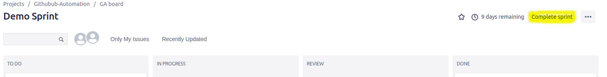

# Project Closeout

* Ensure all features that were completed in a sprint have open PRs to the dev branch

* Someone from the internal team (trainer, project owner, ect.) must review the PRs and submit the review (See [Reviewing PRs]())

* For the approved features merge into dev branch
  * A feature is approved if it was included in the showcase and project owners have agreed it is good to go. Whom ever did the code review from the internal team must also sign off on the changes.

* For the rejected features submit the feedback as to why it was rejected and close the PR

* Once all PRs have been merged or closed update the issues in Github. Issues that have been resolved by PR should be closed and if an issue was worked on but is not done then update the issue with the work that has been done and what state the feature is in.

* In Jira go to the active sprint and ensure the status of each of the stories that were assigned to the sprint have the appropriate status.

* Go to the active sprint and close the sprint, this will show you a burndown of the sprint and the metrics surrounding the project's progress.

  
  * When you close the sprint it will ask what to do with the remaining items please select to put them in the next sprint